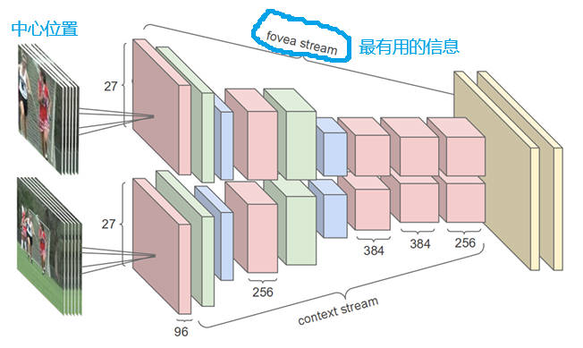

# Large-scale Video Classification with Convolutional Neural Networks（2014）

**[论文链接(点击此处)](https://static.googleusercontent.com/media/research.google.com/zh-CN//pubs/archive/42455.pdf)**

## 核心创新点
- 提出了一个超大数据集——sports-1M，包含一百万个视频、487种类别。
- 提出了一种新的网络架构—— **Multiresolution CNN**（多分辨率卷积网络）。

## 技术细节
### 方法对比

1. Single Frame：视作图片分类任务，从视频里任选一帧，然后把这一帧通过一个卷积神经网络，再通过两层FC，最后得到分类结果。这种方法其实就是一个 baseline，完全不包含时间信息，也没有视频信息。
2. Late Fusion：在网络输出层做融合。从视频中，随机选几帧，然后每一帧都单独通过一个卷积神经网络，这两个网络权值共享。再将两个网络输出的特征合并，再通过FC层，输出结果。这样做就稍微有一些时序上的信息了。
3. Early Fusion：在网络输入层做融合。具体做法是在RGB的channel上直接融合。原来只输入一张图片，有3个channel，现在输入5张图片，就有3x5=15个channel。那就意味着第一层的网络结构要做一定的改变。第一个卷积层接受的输入通道数要从原来的3变成15，之后的网络保持不变。这种方法，可以在输入层就可以感受到时序上的改变，希望能学到一些全局的运动或者时间信息。
4. Slow Fusion：在Late Fusion和Early Fusion基础上提出，Late Fusion融合太晚，Early Fusion融合太早，Slow Fusion采用渐进式融合策略。具体做法是将10帧输入通过时间卷积后产生4个时间响应。最开始的层是权值共享的，在抽出最开始的这些特征后，再去做一些卷积操作，去学习更深层的特征。最后融合2个特征，通过FC层做输出。这种设计让网络能够层次化地理解视频：从局部运动模式到全局行为语义，体现了从底层特征到高层语义的渐进式抽象过程，类似于下采样过程。

上面四种方法中Slow Fusion效果最好，但仍比不上手工特征。
### 方法概述
多分辨率网络降低了输入维度。原始单帧网络输入为178x178x3；多分辨率网络中context stream输入为89x89x3（下采样后的全图），fovea stream输入为89x89x3（原分辨率的中心区域），为原始单帧网络输入的一半。
### 网络架构

### 实现细节
将输入分成两部分，一个是原图，另外一个是从原图的正中心抠出来的一部分。无论是对图片还是视频，最有用的物体大多会出现在图片或者视频的正中心。图中上面一条网络流叫做 fovea stream，下面一条网络流叫做 context stream。fovea 是人眼视网膜最中心的凹陷地方，是对外界变化最敏感的一个区域；context 就是指图片的整体信息。作者想通过这两种操作让网络同时学到最有用的信息和图片整体的信息。这个架构也算是双流结构，其中两个网络权值共享。

## 个人理解
### 思考：如何理解 fovea stream？
作者强制性想让这个网络去关注图片的中心区域，这种结构可以理解为早期对**注意力**的一种使用方式。
### 思考：如何理解Slow Fusion？
与下采样核心思想一致。  
下采样：牺牲空间细节，获得更高层的语义信息。  
Slow Fusion：牺牲时间细节，获得更完整的行为理解。  
Slow Fusion 可以看作是时间维度的池化过程，逐层将时间信息从分散的帧级表示聚合成统一的序列表示，体现了深度网络中从具体到抽象，从局部到全局的信息处理模式。

### 代码分析
复现完代码再写

## 总结与启发
### 贡献
不仅提出了当时最大的视频理解数据集，而且是使用神经网络处理视频理解的最早期工作，作者把最直接的方式全都试了一遍，为后续的工作做了一个很好的铺垫。
### 局限性
效果很差，即使是最好的变体准确度仅为65.4%，而当时最好的手工方法已经可以达到87%的准确度。
### 启发
不一定要达到SOTA，可以总结前人经验，为后人铺路，照样是一个有意义的工作。