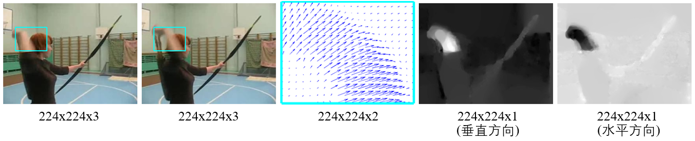
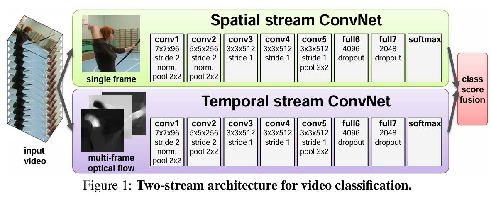

# Two-Stream Convolutional Networks for Action Recognition in Videos（2014）

**[论文链接(点击此处)](https://arxiv.org/pdf/1406.2199)**

## 核心创新点
- 首次提出双流的神经网络架构，一个网络处理空间流信息(静态图片)，一个网络处理时间流信息(时序)
- 首次将光流信息作为CNN网络的输入，从而捕捉时序信息
- 验证在ImageNet上预训练的模型可以有效迁移到视频理解任务上

## 技术细节
### 方法概述
双流(Two-Stream)网络，顾名思义，分别指空间流(Spatial Stream)和时间流(Temporal Stream)，其中空间流以包含场景和物体信息的单个关键帧为输入，时间流以包含跨帧运动的光流为输入。

optical flow(光流)：描述视频中各个物体之间如何运动。

### 网络架构

### 实现细节
不论视频多长，等间隔抽取25帧，crop+flip，1张图变10张图，每张图通过空间流神经网络得到分类结果，做平均；从25帧位置的开始往后连续取11帧抽取光流，光流送入时间流网络，对分类结果取平均；最后将两个网络的结果取平均(late fusion)。

数据增强 crop 操作示意图

crop(裁剪)：1张图->5张图

flip(翻转)：5张图->10张图

## 个人理解
### 思考：为什么要提出双流？
单个网络处理静态图片，学不到时序信息。
### 思考：两个神经网络的作用？
空间流神经网络学习RGB图像到最后分类结果的映射，时间流神经网络学习光流到分类结果的映射。
### 代码分析
复现完代码再写

## 总结与启发
### 贡献
第一个使用神经网络达到与特征提取一样好的效果，从此开启了深度学习在视频理解领域的广泛运用与研究。

### 局限性
计算光流速度慢，需要很大的存储空间。

计算一帧光流大概需0.06s，UCF-101数据集(小型数据集)共1万个视频，假设每个视频10s，每秒30帧，则计算所有光流一共需要 10000x10x30x0.06s=3Mx0.06s=50h，存储所有光流需要1.5t(dense)内存。
论文中使用的小tip：rescale成[0,255]，以JPEG格式存储光流。(dense->sprase)
### 启发
当神经网络难以训练时，不如提供先验信息，使得任务变得简单易解；
引入光流信息其实就是多模态学习。